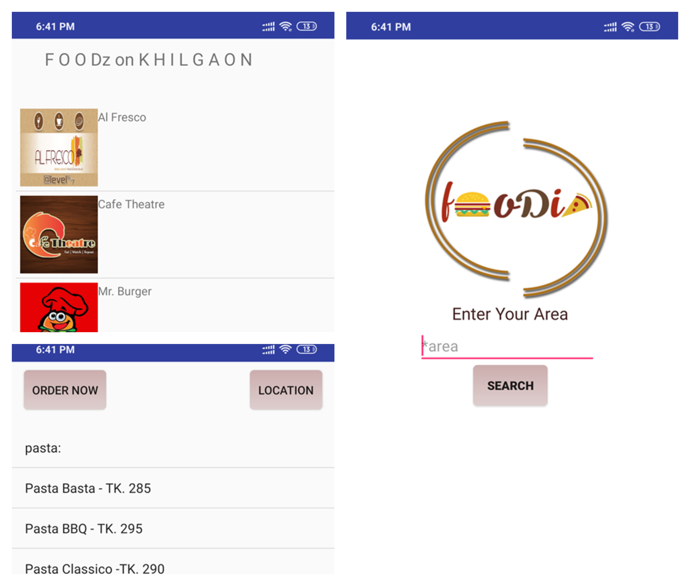

# Foodie

A android based platform for finding out restaurents (initially for Dhaka city). There users can act several actions.

>Individual user platform

>Fast search result according to area

>Ordering food instantly and finding out the location

Used Tools : Java, XML, SQLite, Android Studio

<h2>Snap of Project</h2>

